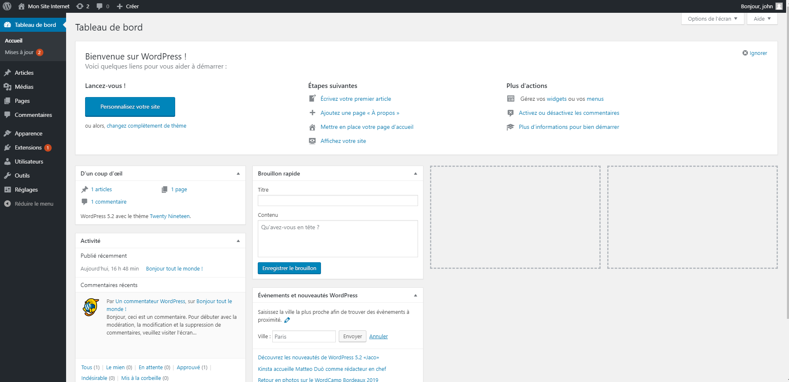

#Administration de WordPress

Ce chapitre est une présentation global de l'interface d'administration de Wordpress les éléments seront étudiés en detais dans les chapitres suivants.
##Tableau de bord et barre d'administration WordPress

**Le tableau de bord** peut être la première chose que vous voyez une fois que vous êtes connecté. Vous pouvez commencer à personnaliser votre site Web à partir d'ici uniquement. Même cela vous permet de rester informé sur les nouvelles mises à jour, les événements et actualités WordPress, vos activités, etc. Ces éléments peuvent également être personnalisés. Vous pouvez conserver les éléments pertinents et supprimer ceux qui ne sont pas nécessaires. **Barre d'administration** - La barre de navigation supérieure située au-dessus du tableau de bord offre des options administratives. L'option **Mon blog** vous offre une vue publique de votre site. Afin de vous aider à décider s’il existe une marge de personnalisation ou de modification. La barre d'outils indique même s'il existe une mise à jour disponible dans un plugin ou un thème, que ce soit. Le côté droit de la barre d'outils contient des options pour modifier le profil et vous déconnecter.

###Barre de menus 
Barre de menus située à l'extrême gauche de l'écran. Il possède toutes les options pour personnaliser votre site WordPress à partir de pages, messages, plugins et paramètres. Vous pouvez contrôler tous les éléments appartenant à votre site à partir d'ici. Maintenant, vous pouvez voir toutes les options comme suit:

###Des postes

Par défaut, vous ne recevez qu'un seul message “Hello World !!” après une nouvelle installation de WordPress. Bien sûr, si vous souhaitez ajouter davantage de publications, modifier celles qui existent déjà ou voir toutes les informations dont vous disposez, vous devez sélectionner l'une des options suivantes. Toutes les publications affiche **toutes les publications** disponibles sur votre site Web WordPress. **Ajouter** pour ajouter de nouveaux articles. **Les catégories** vous permettent de créer des catégories à affecter aux publications. L'option **Tags** est disponible pour attribuer des tags à vos publications. Pour ajouter un nouvel article: voici ce que vous devez faire. Recherchez **articles** dans la barre latérale du tableau de bord -> **Ajouter un nouveau**. Remplissez le titre de l'article, écrivez-le, ajoutez un média et appuyez simplement sur le bouton «Publier» qui apparaît à droite de la page. C’est ainsi que vous avez créé une publication sur votre site Web.

###Médias

Ceci est utilisé pour garder une trace de tous les besoins multimédia de votre site audio, vidéo et images. Il a deux options **Bibliothèque** et **Ajouter nouveau**. La bibliothèque contient tous les fichiers multimédias que vous avez déjà téléchargés. Ajouter nouveau peut vous aider à télécharger un nouveau fichier multimédia en le parcourant.

###Des pages

WordPress vous donne une "Sample Page" par défaut. Vous pouvez l'éditer ou le supprimer. Vous verrez deux options ici - P**pages** et ajouter un nouveau.

le lien ***pages*** vous montrera  une liste de toutes les pages que vous avez créées jusqu'à la date actuelle avec tous les détails Titre, auteur, date de publication, etc. & même vous pouvez éditer ou supprimer une page à partir d'ici uniquement. **Ajouter nouveau** peut vous aider à ajouter une nouvelle page.WordPress a fourni l’outil **«Pages»** sur le tableau de bord. Sélectionnez Pages -> Ajouter nouveau pour ajouter une nouvelle page. Lorsque vous choisissez d'ajouter une nouvelle page, vous êtes directement déplacé vers l'éditeur. Vous pouvez ajouter du texte, des médias et des liens dans votre page avec les outils d'édition disponibles. Après avoir créé la page, vous pouvez également en avoir un aperçu. "Publiez" votre page à la fin. Les options affichées à droite sont appelées **options de thème**.

###commentaires

Vous pouvez suivre tous les commentaires postés par les lecteurs sur les articles spécifiés avec des informations sur la date et l'auteur.

###Apparence

Il affichera tous les **thèmes** installés ainsi que des **widgets** (nous reviendrons sur ce element), des **menus**, des **en-têtes** et des options de personnalisation du thème activé et de **l'éditeur** (pour modifier le code du thème) supplémentaires. L'option Thèmes intègre tous les thèmes disponibles. On peut également installer de nouveaux thèmes dans cette section. L'option Personnaliser vous offre des possibilités de **personnalisation** pour votre thème installé via l'interface frontale. Widgets affiche la liste des widgets actifs. Il peut même conserver une liste de ceux qui ont été supprimés dans la catégorie des «widgets inactifs». L’option **Menus** vous permet de concevoir la structure de menus de votre site Web. L'onglet **Modifier le menu** vous permet de créer de nouveaux éléments de menu et de modifier ceux existants. **L'onglet Gérer les emplacements** vous permet de définir la position d'affichage de votre menu. Le nombre d'emplacements de menu dépend du thème que vous utilisez.

###Ajouter des éléments de menu

Vous pouvez créer votre propre menu et y ajouter vos pages à partir des «Menus». Apparence -> Menus -> Créer un nouveau menu Vous pouvez ajouter des pages, des liens personnalisés et des catégories dans le menu. Pour cela, sélectionnez le menu que vous avez créé à l'étape ci-dessus. Ensuite, recherchez les éléments que vous souhaitez ajouter dans le menu, par exemple. si vous souhaitez ajouter la page «Blog» dans le menu. Alors, sélectionnez cette page et appuyez sur "Ajouter au menu". Assurez-vous d’avoir appuyé sur «Enregistrer le menu» à la fin. Semblable aux pages, vous pouvez ajouter des liens personnalisés et des catégories au menu.

###Structure du menu

Vous pouvez organiser les éléments du menu dans l'ordre de votre choix en les faisant simplement glisser de leur position et en les déposant au niveau souhaité. **En-tête** décide comment l’en-tête de votre blog ou de votre site Web sera affiché. Vous pouvez personnaliser les paramètres d'en-tête à partir de l'interface frontale, comme dans l'option Personnaliser ci-dessus. L'option **Editeur** vous permet de modifier la feuille de style, l'en-tête et d'autres fichiers de thème pour une conception et des fonctionnalités personnalisées.

###Plugins

Les plugins sont utilisés pour fournir des fonctionnalités supplémentaires au site. Ceux-ci peuvent implémenter presque toutes les fonctionnalités souhaitées. L'option Plugins installés affiche tous les plugins que vous avez installés à l'unisson. Ici, vous pouvez installer de nouveaux plugins à partir du référentiel WordPress ou même télécharger n'importe quel plugin personnalisé. **Editor** vous permet de modifier les fichiers du plug-in, si nécessaire.

###Utilisateurs

Dans WordPress, vous pouvez **gérer les utilisateurs** en spécifiant leurs rôles afin de limiter leur pouvoir d’utilisation sur votre site. avec l'option Utilisateurs. **Tous les utilisateurs** présentent tous les utilisateurs existants. **Ajouter nouveau** vous permet d'ajouter de nouveaux utilisateurs. **Votre option de profil** vous permet d’afficher tout votre profil.

###Outils

Il affiche tous les outils disponibles. Vous pouvez importer des publications, des pages sur votre site WordPress à partir d'ici ainsi que exporter un fichier .XML de votre contenu (publication, page, média).

###Réglages

Comme son nom l’indique, il vous permettra de régler tous les types de paramètres suivants: **Général** gère les options disponibles pour le site, telles que le titre, le slogan, 'adresse WordPress, l'adresse du site, l'adresse électronique, la langue du site, le format de date et d'heure, etc. **L'option d'écriture** permet de définir les paramètres de la catégorie poster sur Wordpress par email. **Reading** fournit des options pour contrôler la mise en page de la page d'accueil et du blog de votre site. Vous pouvez définir le nombre de publications visibles sur votre page d'accueil ou sur votre blog. **L'option de discussion** fournit des paramètres pour la section de commentaires du site Web. **La modération des commentaires** est l’une des principales options de cette catégorie qui vous permet de contrôler les commentaires de spam sur votre site.**L'option Permaliens** permet de créer une structure d'URL personnalisée pour vos publications sur le site, vos pages, etc.