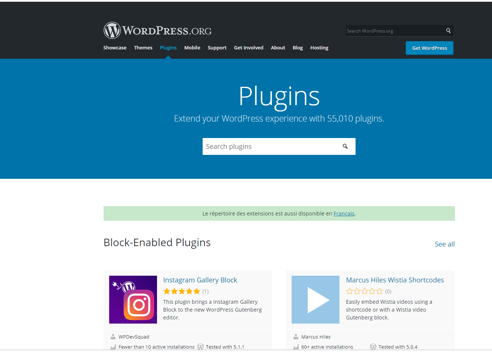

#A propos de Wordpress

Choisir une plate-forme parfaite pour créer un site Web ou un blog peut être fatiguant et nécessite des recherches. Il existe de nombreuses options à choisir dans la liste celle des systèmes de gestion de contenu (CMS). WordPress est l'un d'entre eux. Selon Wikipedia - «WordPress serait le système de gestion de sites Web ou de blogs le plus populaire utilisé sur le Web, prenant en charge plus de 60 millions de sites Web». WordPress "alimente plus de 25% d'Internet - avec des intérêts allant des actualités qui façonnent notre monde aux histoires personnelles qui façonnent nos propres familles et vies".Parlons maintenant en détail de WordPress. C’est un système de gestion de contenu puissant, réputé pour son installation en un clic en 5 minutes, ainsi que pour GRATUITEMENT. “WordPress est complètement personnalisable et peut être utilisé pour presque tout”.La plupart des personnes cherchant à créer des sites Web sont souvent séduites. Bien que vous puissiez télécharger et installer WordPress GRATUITEMENT. WordPress nécessite un service d'hébergement pour que votre site Web soit vu du monde entier. Vous devrez payer un fournisseur de services d'hébergement Web pour mettre en ligne votre site Web WordPress auto-hébergé. La plupart des meilleurs services d'hébergement Web pour WordPress ont pré-installé WordPress.bien sûr vous pouvez voir le cour sur Fonctionenent des hebergeur et noms de domaines avant de continuer.

#Qu'est-ce que WordPress a à offrir?

###Liberté d'utiliser des thèmes personnalisés

WordPress auto-hébergé permet au concepteur Web ou à tout utilisateur de choisir parmi autant de thèmes disponibles sur le Web - qu'ils soient gratuits, payants ou personnalisés! Aucun doute, il y a des thèmes gratuits disponibles. Cependant, ceux conçus à l'aide du logiciel de création de thèmes TemplateToaster dépassent les autres en raison de leurs performances élevées et de leur esthétique. L'option de flexibilité dans la conception vous donne le superpouvoir d'ajouter une touche personnelle à vos thèmes WordPress - Faites par vous, uniquement pour votre site web!

###Des extensions personnalisées sans fin

WordPress donne à l'utilisateur / concepteur la liberté de télécharger et de profiter de nombreux plugins (extensions) gratuits, payants et personnalisés disponibles. Les plugins sont minuscules mais ils font une énorme différence! Ils ajoutent les fonctionnalités souhaitées à votre site, peuvent rendre votre site plus optimisé et convivial. Cependant, avec autant de plugins disponibles par autant d'auteurs aujourd'hui, il faut des recherches pour trouver le meilleur pour votre site et ce qui fonctionne le mieux pour votre site Web auto-hébergé WordPress. ne vous en faite pas si vous ne comprenenez pas les notions commes plugins nous y reviendrons

###Nom de domaine personnalisé

Comme indiqué, la création d'un site Web avec WordPress n'est possible que lorsque vous payez à un fournisseur de services d'hébergement Web. Vous pouvez utiliser votre nom de domaine personnalisé lorsque vous créez un site Web à l'aide de WordPress. Vous savez bien qu’il est important d’avoir un nom de domaine personnalisé pour bâtir votre identité virtuelle ou la réputation de votre marque. "Un nom de domaine unique et personnalisé établit l'identité de votre marque".

###Responsabilité personnelle pour l'entretien

La responsabilité de maintenir votre site Web à jour et de sauvegarder régulièrement votre site Web WordPress.org auto-hébergé repose sur vos épaules (ou votre fournisseur de service d’hébergement Web, si vous en avez embauché un). C’est votre tâche de garder le contrôle des spams sous contrôle et le plus important est de respecter à tout prix la sécurité du site. Bien que la mise à jour soit considérée comme bonne pour votre site Web, elle peut devenir une raison pouvant créer des obstacles pour la fonctionnalité du site! Comment? Chaque mise à jour est accompagnée de nouvelles fonctions qui peuvent ne pas être compatibles avec les plugins existants sur votre site. Par conséquent, les plugins peuvent ne pas fonctionner correctement ou comme prévu. Cela implique que vous devrez remplacer les anciens plugins. N’oubliez pas de sauvegarder votre site Web WordPress auto-hébergé. 

###Potentiel de monétisation élevé

La décision de monétiser votre blog / site Web est entièrement entre vos mains. Si vous avez un site Web créé avec le service d'hébergement WordPress.org, vous pouvez exploiter le trafic de votre site Web / blog pour gagner de l'argent en plaçant une annonce. liens et bannières d'affiliation sur votre site web. Assurez-vous de placer des bannières publicitaires et des liens pertinents sur votre site Web, afin que tout ne se détourne de rien. Cela devrait être fait de manière stratégique afin de gagner des commissions élevées sur les ventes.

###SEO

Avec votre propre site Web, vous avez toujours la possibilité d'installer des plugins personnalisés pour améliorer les performances et la portée de votre site Web. Le plugin **Yoast SEO** est l’un des plugins les plus téléchargés par les utilisateurs de WordPress. Il s’occupe de l’optimisation technique en aidant à choisir un mot clé cible, vous aidant ainsi à rédiger un meilleur contenu. Il comporte également des extensions telles que Yoast News SEO, Yoast Video SEO et Yoast Local SEO. Choisir un thème convivial pour votre site Web est essentiel pour tirer le meilleur parti du point de vue du **référencement**. "Si vous ne pouvez pas faire de grandes choses, faites de petites choses de manière géniale" Choisissez des stratégies de référencement actionnables et mettez-les en œuvre de manière judicieuse. 

#La question?

Mais vous vous dites mais Christian Je suis déjà dévéloppeur et j'ai l'habitude d'ecrire des centaines de lignes de codes afin de lancer un site donc le code c'est terminé?
EUH NON .Même s'il existe Wordpress pour faire des sites plus rapidement vous aurez besoin parfois de faire certaines architechtures de vous même car le faire avec wordpress vous demandra unpeu plus de temps afin de comprendre certains thèmes. De plus nous avons mentioné les plugins et le faite de faire des recherches (pouvant prendre du temps et cela pour tous les plugins) pour trouver les meilleurs sans oublier que certains d'entre eux sont payant.

Donc je vous donne rendez-vous dans le Chapitre 2 afin d'**installer Wordpress**
