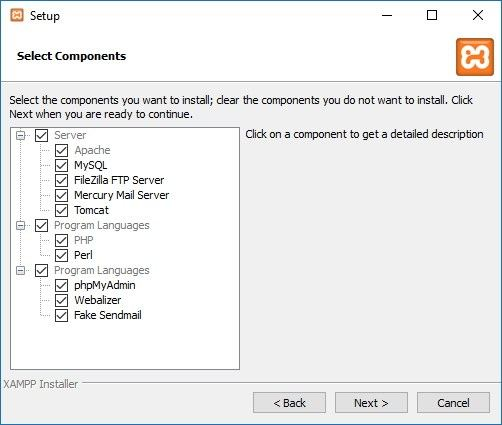
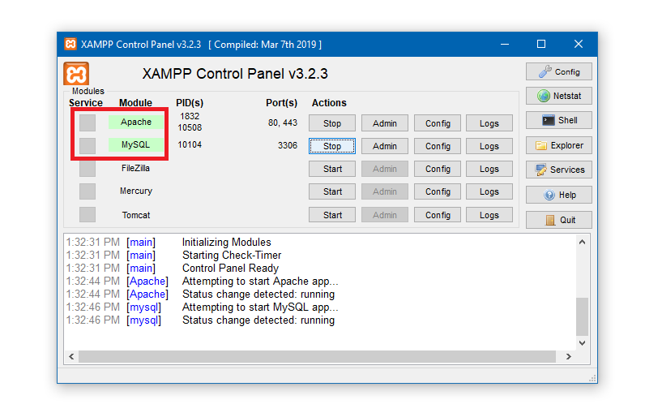
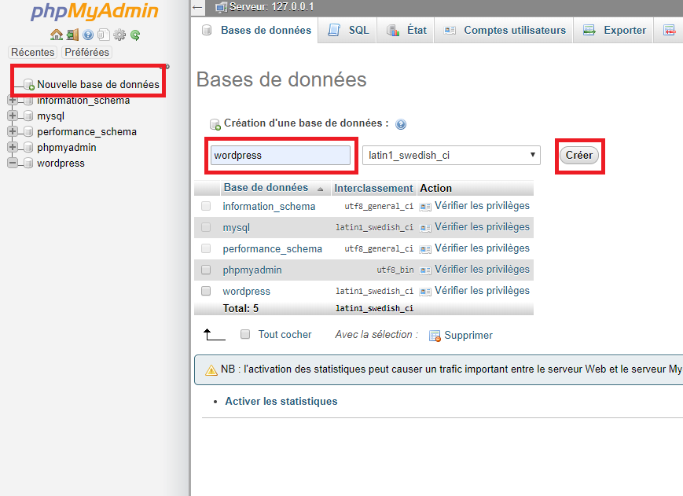
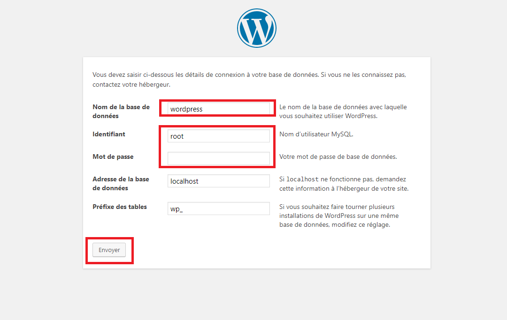
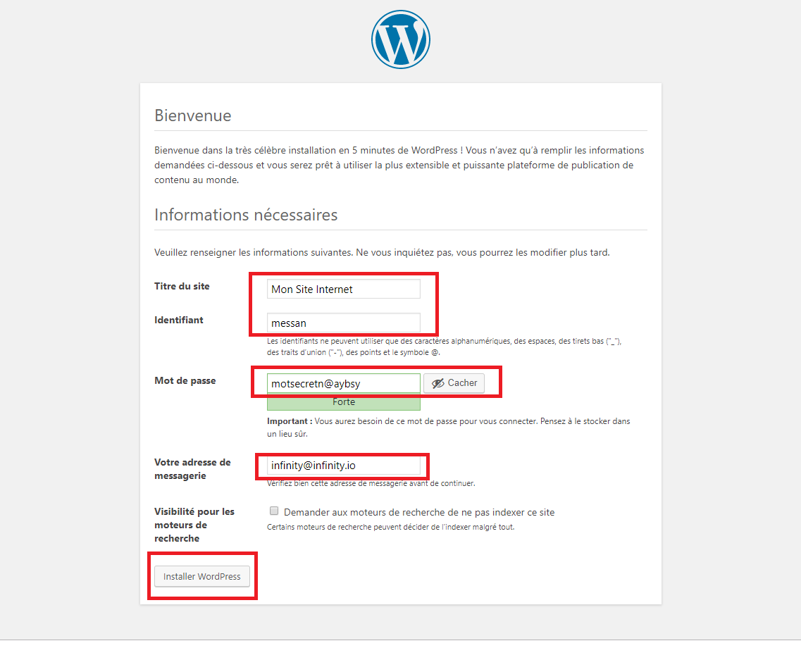
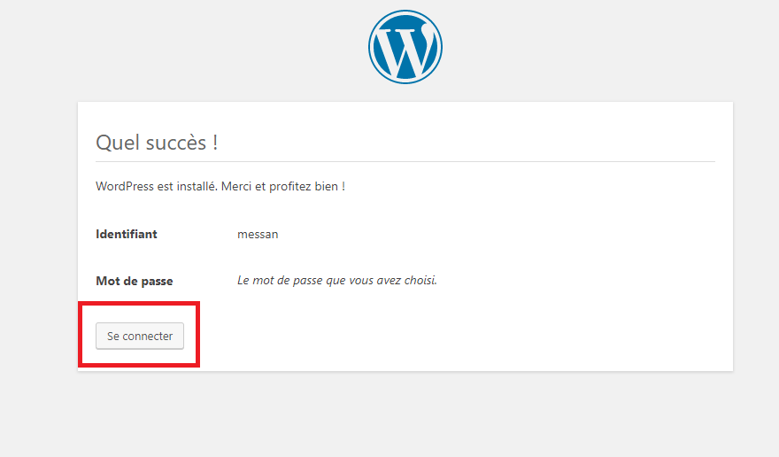

Avec WordPress.org ou ce que nous appelons WordPress auto-hébergé, vous avez un contrôle total sur les thèmes et les plugins. Vous pouvez facilement modifier les thèmes en utilisant notre logiciel de création de thèmes en fonction de vos besoins pour votre propre site web - Votre adresse virtuelle dans le monde du Web!

#Installer et configurer

La célèbre installation «5 minutes» de Wordpress requiert certaines conditions préalables, telles qu'un accès à votre serveur Web, un éditeur de texte, un client FTP, un support de serveur Web et la possibilité de créer des bases de données MYSQL. Une fois la liste de contrôle terminée, vous pouvez très bien lancer le processus d’installation. Les étapes sont fournies ci-dessous:

##Configuration et installation

Il y a 3 étapes principales pour installer WordPress comme suit:

###Étape 1: Achetez votre domaine et votre hébergement Web (BlueHost, Godaddy, Hostgator, par exemple)

 Rendez-vous chez votre fournisseur choisi et achetez votre domaine. Nous vous recommandons d’en choisir un avec un suffixe familier, tel que .org ou .com, même s’ils sont un peu plus chers que les autres, car ils seront plus faciles à mémoriser. Cela lui donne même un aspect digne de confiance. Vous devez acheter de l’espace sur le serveur d’un autre utilisateur, car celui-ci fonctionnera toujours. Si vous l'avez hébergé sur votre serveur local, par exemple sur votre PC domestique. Vous ne seriez jamais capable de l'éteindre ou votre site Web tomberait!

###Étape 2: Installez WordPress sur votre hôte

 Tous les principaux hébergeurs Web fournissent une installation en un clic de WordPress. Connectez-vous à votre - Bluehost si c'est ce que vous avez choisi, ou à un autre - et installez WordPress sur votre domaine. Tous les principaux fournisseurs d’hébergement ont des instructions claires sur la façon d’installer WordPress, ce qui revient essentiellement à une installation en un clic! Cela ne pourrait pas être plus facile que cela.

###Étape 3: connectez-vous à votre CMS WordPress et installez un thème

Une fois dans le fournisseur d’hébergement cPanel (essentiellement le backend de votre site Web) sur lequel WordPress est installé, vous devez vous connecter à votre CMS (système de gestion de contenu) WordPress pour commencer à créer votre site. Vous vous connectez en utilisant les détails du compte WordPress que le fournisseur d'hébergement vous aura envoyé par courrier électronique. Vous pouvez également accéder à l'adresse de l'administrateur de votre domaine, à savoir http: //votredomaine.xx/wp-admin, pour vous connecter.

##Installation locale de WordPress dans XAMPP

La combinaison XAMPP & WordPress est grandement utilisée pour le développement de sites Web. Alors que XAMPP fournit l'environnement serveur local, WordPress est une plate-forme de développement Web. XAMPP est l’application localhost la plus utilisée par les développeurs. Étant multi-plateforme, il peut être utilisé sous Windows, Linux et OSx. Dans cet article, nous discuterons de l'installation de XAMPP et de WordPress sous Windows.

###Installation de XAMPP

Commencez avec la configuration

Téléchargez XAMPP pour Windows à partir d’apachefriends.org. Ensuite, lancez l’installateur pour commencer avec l’installation de XAMPP.

###Sélection des composants

Dans l'assistant de composant, tous les composants sont sélectionnés par défaut. Vous pouvez décocher les composants que vous ne prévoyez pas d’utiliser. Passons rapidement en revue ces composants.

Apache - C'est le serveur Web HTTP, et indispensable pour exécuter le site Web.
MySQL- C'est le serveur de base de données.
FileZilla FTP server - Il est utilisé pour configurer un serveur FTP.
Mercury Mail Server: il est utilisé pour configurer un système de transport de courrier.
Tomcat-It est un serveur d'applications qui exécute des applications Web basées sur Java.
PHP- C'est un langage de script côté serveur utilisé pour créer des pages Web dynamiques.
Perl - Ce langage est largement utilisé par les programmeurs pour écrire des scripts CGI. PhpMyAdmin- C'est un composant nécessaire pour gérer l'administration de MySQL. Webalizer - Il s'agit d'un analyseur de fichier journal Web, qui génère des rapports statistiques sur le nombre de personnes visitant un site Web et ce qu'elles recherchent sur le site Web.
Fake Sendmail - Pour tester le transfert d'email sur localhost, Fake Sendmail est utilisé. Si vous allez travailler sur un projet de ce type impliquant l'envoi d'e-mails, ce 
composant vous sera utile. 

Nous avons choisi Apache, MySQL, PHP et phpMyAdmin car ceux-ci sont nécessairement requis pour l'installation de WordPress. Comme nous n’avons pas prévu d’utiliser les composants restants, nous les avons tous décochés.

###Installer

Après avoir sélectionné les composants, vous serez invité à spécifier un emplacement où vous souhaitez installer XAMPP. Une fois l'emplacement spécifié, l'installation sera prête à être installée.

###Démarrer Apache et MySQL

 Une fois l'installation terminée, ouvrez le panneau de configuration XAMPP. Pour cela, recherchez le fichier xamppcontrol.exe dans le dossier XAMPP et lancez-le. C: \ xampp est l’emplacement par défaut du dossier XAMPP. Après l’ouverture du panneau de configuration, démarrez les composants Apache et MySQL. Lorsque vous lancerez ces composants, leurs liens d’administration deviendront cliquables. Ensuite, sélectionnez “Admin” MySQL pour passer à phpMyAdmin ou ouvrez-le à partir d’ici http: // localhost / phpmyadmin.

###Installation de WordPress

####Créer une base de données MySQL 

Sur l'interface phpMyAdmin, recherchez l'outil “Bases de données” en haut à gauche et créez la base de données. Par exemple, nous avons créé la base de données sous le nom de wordpress. 

####Décompressez le fichier zip

 WordPress Après avoir créé la base de données, nous sommes prêts à démarrer l'installation de WordPress. Nous allons maintenant télécharger WordPress. Une fois le téléchargement terminé,extrayez le fichier zip dans C: \ xampp \ htdocs \. Si vous avez correctement extrait le paquet, vous verrez le dossier «wordpress» dans htdocs. 

###Sélectionnez la langue 

La prochaine étape consiste à parcourir cette URL - http://localhost/ wordress dans votre navigateur pour initialiser l'installation réelle de WordPress. Sélectionnez la langue à l'écran et continuez. 

####Remplir les informations de la base de données

 Remplissez le nom de la base de données que vous avez créée à l'étape ci-dessus. Dans notre cas, c'est "wordpress". Remplissez “root” dans le champ nom d'utilisateur et laissez le champ mot de passe vide, puis remplissez localhost le champ hôte de la base de données. Dans le dernier champ, vous pouvez définir un préfixe pour toutes les tables de la base de données et soumettre. 
 
 ####Complétez les informations du site Web 
 
 

 À l'étape suivante, vous êtes invité à définir le titre de votre site et à renseigner les informations relatives à l'utilisateur, telles que le titre du site, le nom d'utilisateur, le mot de passe et l'adresse électronique. Remplissez les champs obligatoires et appuyez sur «Installer WordPress». C'est tout. Vous avez installé WordPress. Maintenant, vous êtes en affaires. 
 
 ####Connexion au tableau de bord

 
  Vous avez maintenant installé WordPress localement. Vous pouvez accéder au tableau de bord en cliquant sur le bouton Connexion.